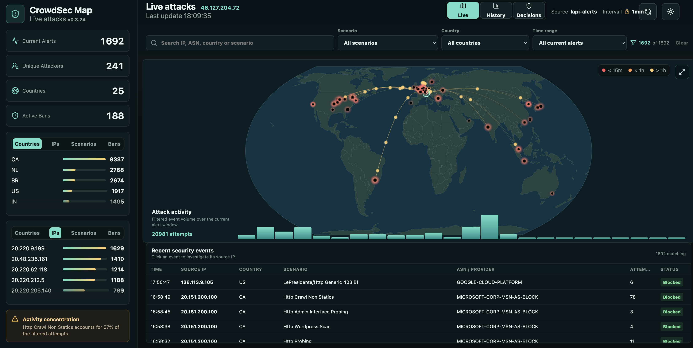

[](https://www.buymeacoffee.com/paddy73.ch)

# CrowdSec Map

CrowdSec Map is a small Docker web app that visualizes CrowdSec alerts and decisions on a live world map. It shows attack origins, active bans, countries, source IPs, scenarios, and a compact timeline for recent activity.

> See where your CrowdSec detections come from, spot patterns at a glance, and investigate a suspicious IP without leaving your dashboard.

## Public demo

Try the [public CrowdSec Map demo](https://crowdsec-map-demo.paddy73.ch). It uses a static snapshot of real CrowdSec alerts; it has no connection to a live CrowdSec deployment and does not expose a target IP.

## Video demos

This recording uses live CrowdSec alert data. The protected target IP is masked.

- [60-second silent demo](docs/demo-assets/crowdsec-map-live-demo-masked.mov)



## Run it in minutes

Use the published image with Docker Compose:

```bash
curl -O https://raw.githubusercontent.com/paddy73-ch/crowdsec-map/main/docker-compose.image.yml
docker compose -f docker-compose.image.yml up -d
```

Then open `http://localhost:8088`. Configure LAPI credentials or the `cscli` fallback as described below to display your own CrowdSec data.

**Made for self-hosted CrowdSec deployments:** Docker, Proxmox/LXC, Unraid, and Home Assistant dashboards.

> [!IMPORTANT]
> **Unofficial community project:** CrowdSec Map is an independent project and is not an official CrowdSec product, service, or solution. It is not developed, maintained, endorsed, or supported by CrowdSec. CrowdSec and related names or marks belong to their respective owners.

## Quick Start

For local builds or the existing Proxmox/LXC deployment:

```bash
docker compose up -d --build
```

Open the dashboard:

```text
http://192.168.192.101:8088
```

### Deployment ports

The three deployments on `.101` use separate host ports:

| Environment | Branch | URL |
| --- | --- | --- |
| Production | `main` | `http://192.168.192.101:8088` |
| Development | `dev` | `http://192.168.192.101:8089` |
| Demo | — | `http://192.168.192.101:8090` |

Start the development deployment from the `dev` branch. It uses a separate
container and persistent data volume, so it can run beside production:

```bash
docker compose -p crowdsec-map-dev -f docker-compose.yml -f docker-compose.dev.yml up -d --build
```

When the work is approved, merge `dev` into `main` and deploy `main` normally
on port `8088`.

## Data Sources

The Live map uses `LAPI alerts` as its primary source. In `Auto` mode it falls back to `cscli` and finally to `Sample` if LAPI is unavailable. Enforcement decisions are intentionally separated into the paginated `Decisions` view because blocklists are not detected attacks.

## Dashboard Features

- Toolbar source selection.
- Toolbar refresh interval selection: `30s`, `1min`, `5min`, `30min`.
- Browser-persisted interval, ranking panel selections, and timeline row count.
- `Active Bans` metric in the top-left summary area.
- Ranking panels for `Countries`, `IPs`, `Scenarios`, and `Bans`.
- Search and live filters for source IP, ASN, country, scenario, and alert age.
- Filter-aware attack activity chart and recent security event table.
- Inline event detail drawer with a direct path into full IP investigation.
- Active banned IP list with remaining ban duration.
- Timeline grouped by source IP and minute, expandable up to three rows.
- Cached and server-paginated `Decisions` view for CrowdSec enforcement and blocklist data.
- IP Investigation panel inspired by `csfind`: on-demand log hit counts, 403 counts, sampled log lines, and a paginated `See all` log view with search, filter, and sorting.

## Source Option A: LAPI Alerts (Primary)

Alerts are ideal for the map because CrowdSec often includes `source.latitude`, `source.longitude`, `source.cn`, and `source.as_name`.

1. Register a machine directly on the CrowdSec LAPI host.
2. Set `LAPI_URL`, `LAPI_LOGIN`, and `LAPI_PASSWORD`.

Example:

```yaml
environment:
  DATA_SOURCE: "lapi-alerts"
  LAPI_URL: "http://crowdsec:8080"
  LAPI_LOGIN: "crowdsec-map"
  LAPI_PASSWORD: "your-password"
```

## Source Option B: `cscli` Fallback

In `Auto` mode, CrowdSec Map uses `cscli` only when LAPI Alerts cannot be loaded. This requires access to the Docker socket and a CrowdSec container that can run `cscli alerts list -o json`:

```yaml
environment:
  DATA_SOURCE: "auto"
  CROWDSEC_CONTAINER: "crowdsec"
  CSCLI_COMMAND: "cscli alerts list -o json --limit 0"
volumes:
  - /var/run/docker.sock:/var/run/docker.sock:ro
```

Check the fallback command manually:

```bash
docker exec crowdsec cscli alerts list -o json --limit 5
```

## Decisions View

The dedicated Decisions view uses a bouncer key against `/v1/decisions`. Decisions can include tens of thousands of Community and third-party blocklist entries, so they are cached for 60 seconds and returned to the browser in pages of 50. They never enter the attack Timeline or Recorded History.

```yaml
environment:
  LAPI_URL: "http://crowdsec:8080"
  LAPI_API_KEY: "your-bouncer-key"
```

## Guided Setup

For an existing Docker-based or native Linux CrowdSec installation, the helper can create the Alerts machine login, create the Decisions bouncer key, and detect file-based Investigation logs from `acquis.yaml`/`acquis.d`:

```bash
sudo scripts/autosetup-crowdsec-map.sh
```

It automatically detects a Docker-based or native Linux CrowdSec installation, the internal LAPI URL, and file-based Acquisition logs. Ambiguous values are requested interactively and can also be overridden with command-line options. It keeps secrets in a mode-`600` `.env` and does not rotate existing credentials unless explicitly requested. See the [Setup assistant and CTI key guide](docs/setup-assistant.md).

## Environment Variables

| Variable | Purpose |
| --- | --- |
| `PORT` | Web/API port inside the container, default `8088` |
| `DATA_SOURCE` | Live detection source: `auto`, `cscli`, `lapi-alerts`, or `sample` |
| `REFRESH_SECONDS` | Default auto-refresh interval |
| `CROWDSEC_CONTAINER` | Docker container name for `docker exec ... cscli` |
| `CSCLI_COMMAND` | Command executed inside the CrowdSec container |
| `LAPI_LIMIT` | Maximum number of LAPI records; default `0` loads all records |
| `LAPI_URL` | CrowdSec LAPI URL |
| `LAPI_LOGIN` / `LAPI_PASSWORD` | Watcher/machine credentials for alerts |
| `LAPI_API_KEY` | Bouncer key for decisions |
| `PUBLIC_TARGET_IP` | Optional manual public target IP shown in the dashboard header |
| `PUBLIC_TARGET_IP_AUTO` | Auto-detect public target IP when `PUBLIC_TARGET_IP` is empty, default `true` |
| `PUBLIC_TARGET_IP_REFRESH_MINUTES` | Public IP auto-detect refresh interval, default `60` |
| `HISTORY_FILE` | Legacy JSONL history source used once during automatic SQLite migration |
| `HISTORY_DATABASE_FILE` | Persistent SQLite history database, default `data/history.sqlite`; existing JSONL data is migrated automatically |
| `HISTORY_RETENTION_DAYS` | History retention window, default `90` |
| `CTI_API_KEY` | Optional CrowdSec CTI API key for on-demand IP reputation checks |
| `CTI_CACHE_FILE` | Persistent CTI cache file, default `data/cti-cache.json` |
| `CTI_CACHE_HOURS` | CTI cache duration, default `72` |
| `TRUST_PROXY` | Trust reverse proxy headers such as `X-Forwarded-For`, default `true` |
| `ACCESS_LOG_ENABLED` | Optional demo visit logging, default `false` |
| `ACCESS_LOG_FILE` | Persistent demo visit log file, default `data/access-log.jsonl` |
| `ACCESS_LOG_RETENTION_DAYS` | Demo visit log retention, default `30` |
| `INVESTIGATION_LOG_PATHS` | Comma, semicolon, or newline separated log paths/globs for IP investigation |
| `INVESTIGATION_MAX_LINES` | Default sample lines kept per investigation log source, default `50`, UI limit `1-200` |
| `INVESTIGATION_TIMEOUT_MS` | Maximum server-side investigation scan time, default `8000` |

## History storage

CrowdSec Map stores its recorded alert history in SQLite. On the first v0.2.0 start, an existing `history.jsonl` is imported transactionally and deduplicated by alert ID. The original JSONL file is renamed with a `.migrated-<timestamp>` suffix and retained as a backup. New installations write directly to `history.sqlite`.

## IP Investigation

The IP detail overlay includes an on-demand Investigation block. It scans configured, read-only mounted host logs for the selected IP and selected History window. This is designed as the web-app version of the original `csfind` workflow: compare CrowdSec context with reverse proxy, MFA, Proxmox, or other access logs.

Default investigation paths are:

```text
/opt/security-stack/zoraxy/config/log/*.log
/opt/security-stack/authelia/config/authelia.log
/var/log/pveproxy/access.log
```

When CrowdSec Map runs in Docker, the matching host paths must also be mounted into the container as read-only volumes. If no configured files are readable, the UI shows a warning instead of failing the page.

## Docker Image, Unraid, and Home Assistant

The existing `docker-compose.yml` intentionally stays build-based. This keeps the current `.101` deployment path simple and safe.

An optional published image setup is available:

```bash
docker compose -f docker-compose.image.yml up -d
```

GitHub Actions builds the image as:

```text
ghcr.io/paddy73-ch/crowdsec-map:latest
```

- Unraid: see [docs/unraid.md](docs/unraid.md) and [packaging/unraid/crowdsec-map.xml](packaging/unraid/crowdsec-map.xml). The template is provided but has not yet been verified on a real Unraid installation.
- Home Assistant: see [docs/home-assistant.md](docs/home-assistant.md)
- Generic Docker Compose image setup: see [docker-compose.image.yml](docker-compose.image.yml)

## Local Development

```bash
npm install
npm run dev
```

Frontend:

```text
http://localhost:5173
```

Backend:

```text
http://localhost:8088/api/attacks
```

## Notes

- If CrowdSec does not provide coordinates, the app tries to resolve locations with `geoip-lite`.
- If `DATA_SOURCE=auto` cannot reach a real source, the app falls back to sample data and shows a warning in the timeline.
- Using `cscli` from a separate container requires Docker socket access. Use LAPI if you want to avoid mounting the Docker socket.

## License

CrowdSec Map is released under the GNU Affero General Public License v3.0 only. See [LICENSE](LICENSE).
