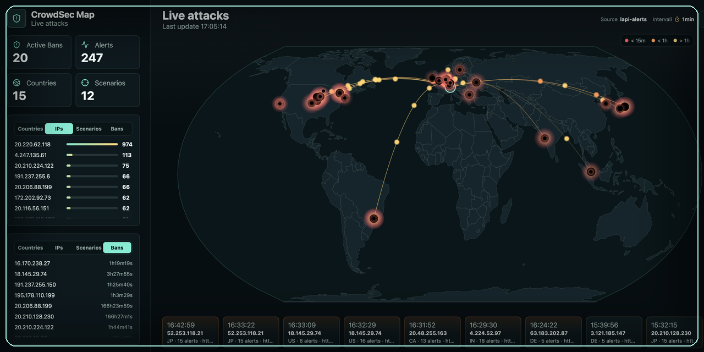

[](https://www.buymeacoffee.com/paddy73.ch)

# CrowdSec Map

CrowdSec Map is a small Docker web app that visualizes CrowdSec alerts and decisions on a live world map. It shows attack origins, active bans, countries, source IPs, scenarios, and a compact timeline for recent activity.

## Quick Start

For local builds or the existing Proxmox/LXC deployment:

```bash
docker compose up -d --build
```

Open the dashboard:

```text
http://192.168.192.101:8088
```

## Data Sources

The app can read multiple CrowdSec sources. In the UI, switch between `Auto`, `LAPI alerts`, `LAPI decisions`, `cscli`, and `Sample`.

## Dashboard Features

- Toolbar source selection.
- Toolbar refresh interval selection: `30s`, `1min`, `5min`, `30min`.
- Browser-persisted interval, ranking panel selections, and timeline row count.
- `Active Bans` metric in the top-left summary area.
- Ranking panels for `Countries`, `IPs`, `Scenarios`, and `Bans`.
- Active banned IP list with remaining ban duration.
- Timeline grouped by source IP and minute, expandable up to three rows.

## Source Option A: `cscli` From an Existing CrowdSec Container

This is the simplest option if your CrowdSec container can already run `cscli alerts list -o json`. Set the container name in `docker-compose.yml`:

```yaml
environment:
  DATA_SOURCE: "cscli"
  CROWDSEC_CONTAINER: "crowdsec"
  CSCLI_COMMAND: "cscli alerts list -o json --limit 250"
volumes:
  - /var/run/docker.sock:/var/run/docker.sock:ro
```

Check the command manually:

```bash
docker exec crowdsec cscli alerts list -o json --limit 5
```

## Source Option B: LAPI Alerts

Alerts are ideal for the map because CrowdSec often includes `source.latitude`, `source.longitude`, `source.cn`, and `source.as_name`.

1. Register a machine for CrowdSec Map.
2. Validate the machine in CrowdSec.
3. Set `LAPI_URL`, `LAPI_LOGIN`, and `LAPI_PASSWORD`.

Example:

```yaml
environment:
  DATA_SOURCE: "lapi-alerts"
  LAPI_URL: "http://crowdsec:8080"
  LAPI_LOGIN: "crowdsec-map"
  LAPI_PASSWORD: "your-password"
```

## Source Option C: LAPI Decisions

This option uses a bouncer key against `/v1/decisions`. It works well for current bans, but depending on your CrowdSec data it may include less context than alerts.

```yaml
environment:
  DATA_SOURCE: "lapi-decisions"
  LAPI_URL: "http://crowdsec:8080"
  LAPI_API_KEY: "your-bouncer-key"
```

## Environment Variables

| Variable | Purpose |
| --- | --- |
| `PORT` | Web/API port inside the container, default `8088` |
| `DATA_SOURCE` | `auto`, `cscli`, `lapi-alerts`, `lapi-decisions`, `sample` |
| `REFRESH_SECONDS` | Default auto-refresh interval |
| `CROWDSEC_CONTAINER` | Docker container name for `docker exec ... cscli` |
| `CSCLI_COMMAND` | Command executed inside the CrowdSec container |
| `LAPI_URL` | CrowdSec LAPI URL |
| `LAPI_LOGIN` / `LAPI_PASSWORD` | Watcher/machine credentials for alerts |
| `LAPI_API_KEY` | Bouncer key for decisions |
| `PUBLIC_TARGET_IP` | Optional manual public target IP shown in the dashboard header |
| `PUBLIC_TARGET_IP_AUTO` | Auto-detect public target IP when `PUBLIC_TARGET_IP` is empty, default `true` |
| `PUBLIC_TARGET_IP_REFRESH_MINUTES` | Public IP auto-detect refresh interval, default `60` |
| `HISTORY_FILE` | Persistent JSONL history file, default `data/history.jsonl` |
| `HISTORY_RETENTION_DAYS` | History retention window, default `90` |
| `CTI_API_KEY` | Optional CrowdSec CTI API key for on-demand IP reputation checks |
| `CTI_CACHE_FILE` | Persistent CTI cache file, default `data/cti-cache.json` |
| `CTI_CACHE_HOURS` | CTI cache duration, default `72` |

## Docker Image, Unraid, and Home Assistant

The existing `docker-compose.yml` intentionally stays build-based. This keeps the current `.101` deployment path simple and safe.

An optional published image setup is available:

```bash
docker compose -f docker-compose.image.yml up -d
```

GitHub Actions builds the image as:

```text
ghcr.io/paddy73-ch/crowdsec-map:latest
```

- Unraid: see [docs/unraid.md](docs/unraid.md) and [packaging/unraid/crowdsec-map.xml](packaging/unraid/crowdsec-map.xml). The template is provided but has not yet been verified on a real Unraid installation.
- Home Assistant: see [docs/home-assistant.md](docs/home-assistant.md)
- Generic Docker Compose image setup: see [docker-compose.image.yml](docker-compose.image.yml)

## Local Development

```bash
npm install
npm run dev
```

Frontend:

```text
http://localhost:5173
```

Backend:

```text
http://localhost:8088/api/attacks
```

## Notes

- If CrowdSec does not provide coordinates, the app tries to resolve locations with `geoip-lite`.
- If `DATA_SOURCE=auto` cannot reach a real source, the app falls back to sample data and shows a warning in the timeline.
- Using `cscli` from a separate container requires Docker socket access. Use LAPI if you want to avoid mounting the Docker socket.

## License

CrowdSec Map is released under the GNU Affero General Public License v3.0 only. See [LICENSE](LICENSE).
